#Is Leonardo DiCaprio going to win an Oscar at last?

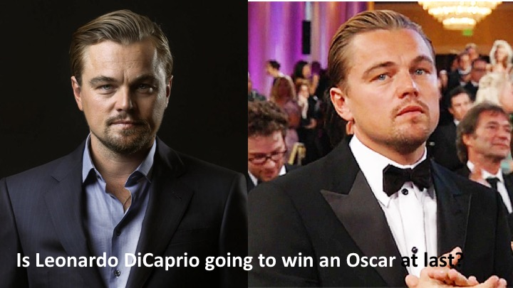 

[[Image credit 1]](http://www.tasteofcinema.com/wp-content/uploads/2014/08/best-Leonardo-DiCaprio-movies.jpg)
[[Image credit 2]](http://umlconnector.com/wp-content/uploads/AE-Sad-Leo.png)

要求
IPython Process Book

An important part of your project is your iPython process book. Your process book details your steps in developing your solution, including how you collected the data, alternative solutions you tried, describing statistical methods you used, and the insights you got. Equally important to your final results is how you got there! Your process book is the place you describe and document the space of possibilities you explored at each step of your project. We strongly advise you to include many visualizations in your process book.Your process book should include the following topics. Depending on your project type the amount of discussion you devote to each of them will vary:

Overview and Motivation: Provide an overview of the project goals and the motivation for it. Consider that this will be read by people who did not see your project proposal.

Related Work: Anything that inspired you, such as a paper, a web site, or something we discussed in class.

Initial Questions: What questions are you trying to answer? How did these questions evolve over the course of the project? What new questions did you consider in the course of your analysis? - Data: Source, scraping method, cleanup, storage, etc.

Exploratory Data Analysis: What visualizations did you use to look at your data in different ways? What are the different statistical methods you considered? Justify the decisions you made, and show any major changes to your ideas. How did you reach these conclusions?

Final Analysis: What did you learn about the data? How did you answer the questions? How can you justify your answers?

Presentation: Present your final results in a compelling and engaging way using text, visualizations, images, and videos on your project web site.

Describe the storytelling elements and goals in your process notebook and show us sketches and screenshots of different website iterations. As this will be your only chance to describe your project in detail make sure that your process book is a standalone document that fully describes your process and results.

##Overview and Motivation

###Motivation

The Academy Awards, more commonly knows as the Oscars, is one of the most anticipated and oldest entertainment annual awards ceremonies in the world. Ever since 1929, the Oscars has honored cinematic achievements (usually) every February for 87 years. Each year, the media and cinema lovers try to predict the winners before the grand ceremony. This year, with two months to go until another exciting Oscars (the 88th), we wish to join the crowd of spectators and make our own predictions on which movie and which actors and actresses will most probably take the golden statue home. 

The Oscars gives out awards in 24 categories, ranging from the most exciting Best Picture, Best Leading Actor/Actress to Best Documentary Short Subject and Best Writing. Our project tries to predict which movies are most likely to win any of the following awards in Best Picture, Directing, Best Actor in a Leading Role, Best Actress in a Leading Role, Best Actress in a Supporting Role and Best Actor in a Supporting Role.

Because Leonardo DiCaprio had been nominated 5 times over the past 10 years, but has never won an Oscar, we take special interest in his award-outcome in the 88th Oscar next year. (He is starred in a movie "The Revenant", which is scheduled to be released on December 25, 2015.)

<table>
<tr>
<th>Year</th>
<th>Leonardo DiCaprio's Oscar Nominations</th>
</tr>
<tr>
<td>2014</td>
<td>Best Performance by an Actor in a Leading Role (
The Wolf of Wall Street (2013))</td>
</tr>
<tr>
<td>2014</td>
<td>Best Motion Picture of the Year (
The Wolf of Wall Street (2013)) </td>
</tr>
<tr>
<td>2007</td>
<td>Best Performance by an Actor in a Leading Role (
Blood Diamond (2006)) </td>
</tr>
<tr>
<td>2005</td>
<td>Best Performance by an Actor in a Leading Role
(The Aviator (2004)) </td>
</tr>
<tr>
<td>1994</td>
<td>Best Actor in a Supporting Role (
What's Eating Gilbert Grape (1993) ) </td>
</tr>
</table>

###Project Overview and Flow

In order to predict the winners of next year's Oscars, we will collect data on past award winning and nominated movies, actors and actresses from IMDb, Rotten Tomatoes and Wikipedia. After obtaining the data and constructing the dataset, we will explore the data and train several classification models for our predictions. 

This project will contain:

1. Scraping the web and creating the dataset for the prediction.

2. Exploratory Data Analysis (EDA).

3. Model fitting and training

4. Prediction results

5. Conclusion

##1. Scraping and Constructing Data Frame
Before we start scraping, let's spend some time discussing the data source and the scrapping methods we used.

###1.1 A short discussion on datasource and scraping methods
The scrapping contains two parts, one for all the movies, actors and actresses nominated and won before the 87th Oscars in 2015, the other for all movies that are eligible for nomination in the 88th Oscars (i.e. all movies in 2015, from midnight at the start of 1 January to midnight at the end of 31 December).

**Part 1** For movies released before 2015

We started with a list of all Oscars winners and nominees in our  categories of interest up to 2014. The categories are: Best Picture, Best Directing, Best Actor in a Leading Role (hereafter denoted as Best Leading Actor), Best Actress in a Leading Role (Best Leading Actress), Best Actor in a Supporting Role (Best Supporting Actor) and finally, Best Actress in a Supporting Role (Best Supporting Actress). The list is here: [academy_awards](scraping/academy_awards.csv). We took the list of all nominated and winning movies up to 2011 from [here](https://www.aggdata.com/awards/oscar) and manually added updated movies so that the file contains all nominated and winning movies up to 2014.

Using the list of movie titles, we scrape  IMDb using a unofficial their free unofficial public API to gather information on each movie and later about their IMDb and Rotten Tomatoes attributes. We then scraped information we think that might be useful for our predictions about the three leading actors/actresses and the directors of each movie on the list. Some example features are credits, date of birth and award nominations. For details about how we scraped the data set, please see [here](scraping/scrapingimdb.ipynb).

We also scrapped wikipedia for all the nominated movies, then scrapped the budget and box-office information off of wikipedia. For details of this part of scrapping, please see the first half of [scrape_wiki notebook](scraping/scrape_wiki.ipynb).

**Part 2** For movies released in 2015

We scrapped [wikipedia page](https://en.wikipedia.org/wiki/2015_in_film) for the list of movies released in 2015 up to the date of the scape, which is 4th of December. After constructing the list, we scraped IMDb for information on budget and box office. Details of this scrape is in the second half of [scrape_wiki notebook](scraping/scrape_wiki.ipynb). 

We also scrapped IMDb API for additional information on the 2015 movies. This part of the scrape is documented [here](scraping/scrapingimdb2015.ipynb).

The final table is [here](EDA/final_table.csv).

##2. Exploratory Data Analysis (EDA).
After we have our dataset, we can do some exploratory data analyasis. Please see iPython notebook [EDA](EDA/EDA.ipynb) for our complete analysis. We take excerpt of some of our results here. Please note that there more information on the file.

### 2.1 Run Time
First, let us look at the run time of winner and nominee movies, shown in fig 2. The green shows the runtime of the nominees and the red shows the runtime of the winners. We also plot the mean and median of each group. The mean of nominees is 24 minutes less than the mean of the winners. The median of the nominees is 14 minutes less than that of the winners. Though the mean and median are different in each group, we cannot tell if movie runtime is a feature that explicitly divides the winners from the nominees because the distributions are very much overlapped. 

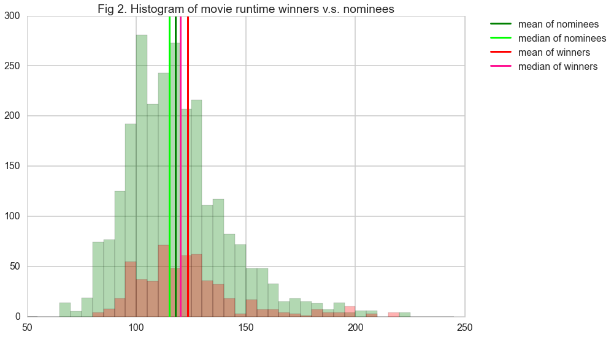

### 2.2 Budget and Box-office 
Besides runtime, we think box office and budget might also play roles in winning oscar. The figure below shows the box office and budget of winning and nominee movies respectively. For box-office, the winning movies tend to have a more uniform distribution than all the nominee movies in USD dollars. While for the budget, winning movies have approximately the same distribution as nominee. Therefore, box-office might be a significant feature in the model. However, it can also be that the movie has won a oscar so more people tend to watch that movie. To deal with this issue, we should have only scarped the box office until right before the oscar. Yet due to the time issue, we just simply scraped the box office until now. 

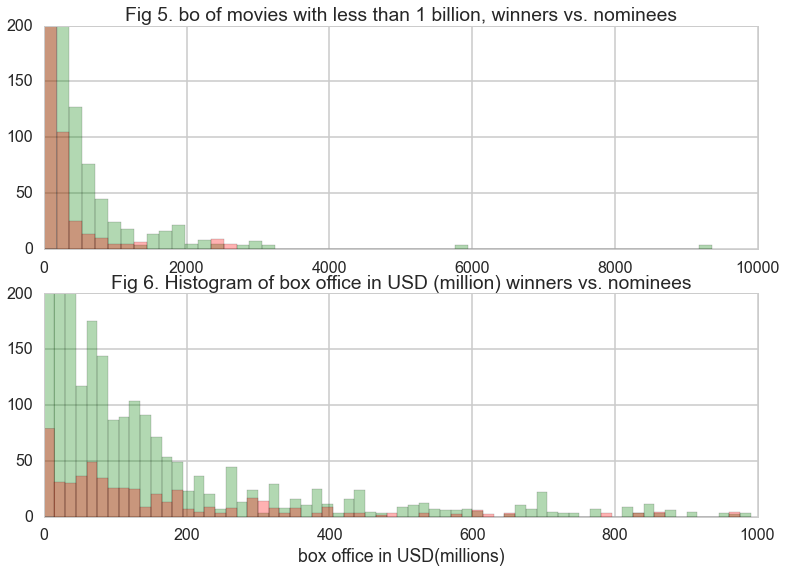

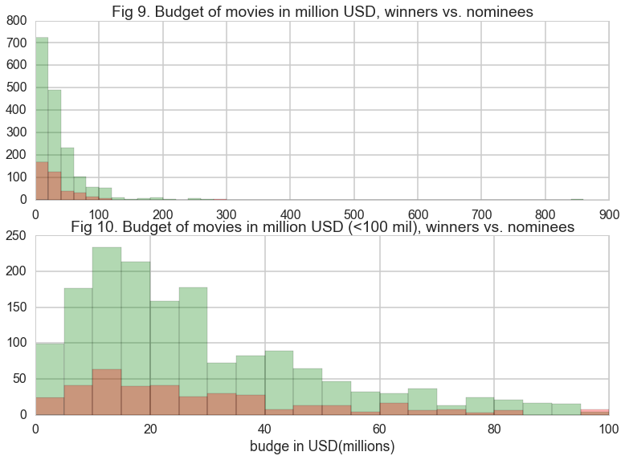

### 2.3 Age and credit of directors and actors
The first one is a comparison of the mean of the actors' age at the time of their nominations for the winners and the nominees. The second to fourth are similar comparisons. We used the same convention of using green for the nominees and red for the winners. The distributions of the two groups overlap, giving us no additional information on how to distinguish between the winners and the nominees. 

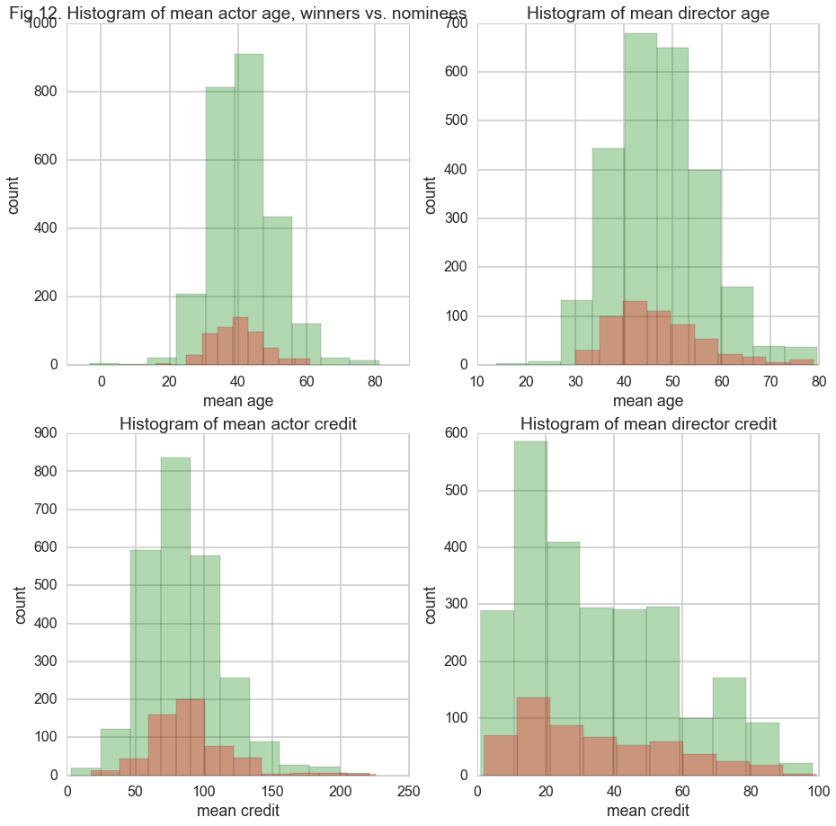

### 2.4 Genre 
To do more exploration on the data, we plot the mean credits of actors and directors in each year for each genre of movie. We can see that actors have higher credits than director in general. By looking at the percentage of genre for nominee and winning movies, we can have some general idea of what kind of genre has larger chance of winning. For example, 'Drama' and 'Romance' have high chance of being nominated and winner.

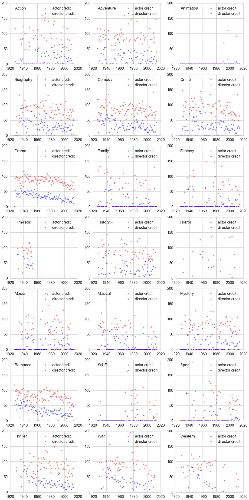

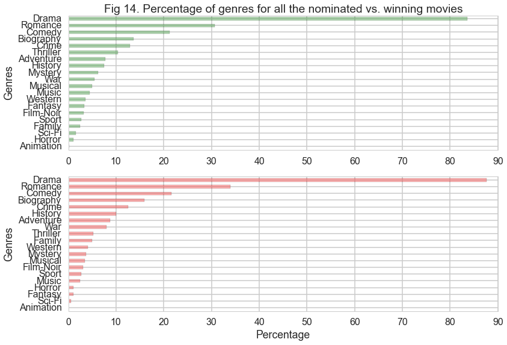

### 2.5 Geography and Birthplace
Just for fun, we also plot two world maps to show where are the actors and directors come from. Most of the actors and directors are from America and Europe, which makes sense because most of the movies in our data come from Hollywood. 

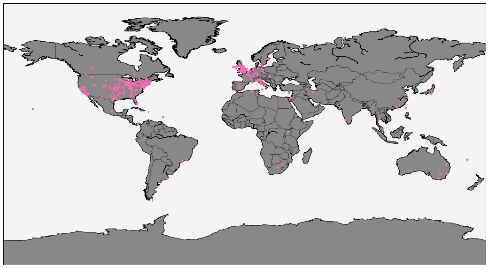

##3. Model Fitting and Training
After constructing our data, we are in shape for making predictions on what 2015 movies are most likely to win at least one Oscars in the five hottest categories (Best Picture, Directing, Best Actor in a Leading Role, Best Actress in a Leading Role, Best Actress in a Supporting Role and Best Actor in a Supporting Role). Now we train several classifiers on the data set to find the best one and then use the the results to predict which movies are most likely to win the Oscars in 2016. First we spend some time cleaning the data set, split it into training and testing sets, then we start testing for classifiers. 

**Please see iPython notebook [Model](Model/Model.ipynb) for our complete analysis.**

Here's a summary of our model fitting results and prediction results.

###3.1 Baseline
Like any other model training project, we give a baseline model, which is that no movies wins the Oscars. Dince only 20% of films in our whole data set have won the Best Picture award, this baseline will give us an accuracy of 80% on the whole dataset. The accuracy score of the baseline on the test set and the training set is also the percentage of no-award wovies. The accuracy score on the training set is 79.8% and the accuracy score on the test set is 83.7%.

###3.2 SVM
Then we spend much time in training several varieties of SVM models.

####3.2.1 Linear SVM
We set up a classifier using LinearSVC. This algorithm implements a linear SVM. We explicitly pass the standard SVM hinge loss. This is only the initial step of the list of SVM classifiers we will try.

The classification returns accuracy on training data: 0.80 and accuracy on test data: 0.84. From the comfusion matrix, we see that this model is similar to predicting that no movie wins the award. Therefore, when we fit the model on the 2015 data and predict the winners for the 88th Oscar, we might have no winning movie. This is indeed the case.

####3.2.2 Feature Select SVM
We will use feature select SVM in this part of our analysis. This model selects 25 most important features and fits linear SVM classifier using the selected features.

This model does not do much better than the previous Linear SVM with all features one, score-wise. This model still predict that all movies earn no award.

####3.2.3 Linear SVM on Balanced Set
One of the reasons for this is that SVM does not do terribly well on an unbalanced data set, so now we balance training set to test set for training. There are many more negative samples in the training set. We want to balance the negative samples to the positive samples. So we concatenate all the indexes and use them to select a new training set from the old one.

After constructing a balanced training set at hand, we now train the linear SVM on the balance set and on all features. Note that this does not fit the real world sinario because there are a lot more movies that doesn't have any Oscar awards the those who wins the award. However, for the sake of giving us some non-trivial prediction, we test out this model.
Notice that because we have balanced the training set, the accuracy score on the trainign set is now 0.5, and the accuracy score on the test data is 0.16, which suggests the model now predicts that all movies win the award. This does not give us much predictive confidence. This model also predicts 0 winner.

####3.2.4 RBF Based Pipelined (feature-selected) SVM on the Subsampled Balanced Set
Let us try a Radial Basis Function (RBF) Kernel, so that we are not restricted to the linear SVM. Note that we use the subsempled set here.

This model gives us some result. Notice that the model no longer predicts no winning movies, the accuracy on training data: 0.70 and accuracy on test data: 0.66. The precision score on the positive test set is now 0.23, which is an improvement from the 0 in previous models. However, when we implement the model on the training set, we still get no positive prediction.

####3.2.5 Refit RBF on the Entire Balanced Data Set
Rather than fitting RBF on the subsampled data set, we try to fit it on the balanced data set and see if we do any better. We get accuracy on training data: 0.59 and accuracy on test data: 0.64. The precision on the positive test sets is 0.24. We get 0 winner from this model.

####3.2.6 SVM with Polynomial Degree 10
In this final SVM model fitting, we try the SVM model with Polynomial with degree 10. Note: In the process of finding the best degree, we tried several degrees and find that they do not make much difference when the degree is larger than 3.

The accuracy score and the precision score from this model is not much different from the previous one, therefore, there is no surprise that we see no positive prediction when we fit the model to the 2015 data.

Finally, we insert a ROC curve comparison of all of our models. Notice that the linear SVM with all features gives the best ROC curve. Then we plot the ROC curve of the Linear SVM model. Notice that our curve is discrete rather than smoothly curved. This means that the model can only provide discrete predictions, rather than a continous score, due to the lack of samples wo have and the small number of continuous features we have.

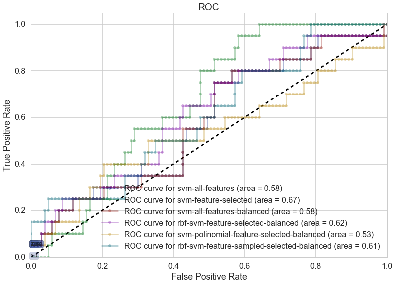

###3.3. Logistic
With the SVMs failing to predict positive results, we try Logistic Regression. This part of the code documents our attempt. Then we use the data balancing technique on logistics. The accuracy on training data: 0.68 and the accuracy on test data: 0.64. The precision score also improves. It is now 0.92 on the negative test set and 0.27 on the positive test set. We should be able to make positive predictions on the 2015 data set. 

Note that our dataset is extremely unbalanced. Therefore we should not accept the default 0.5 threshold value of 0.5, but should set it to a lower value. By setting the threhold value to be 0.2, which is approximately the same as the percentage of positive samples in our training data set. We make all the movies that are predicted to win into a dataframe. We will present the result in **Part 4** below.

We also make a comparison of the ROC curves.

By comparing the best-performing SVM ROC curve with the highest AUC with the logtistics model, we can see that the logistics model performs better based on the ROC curve. Also, the ROC curve of Logistis is smoother than that of the SVM.

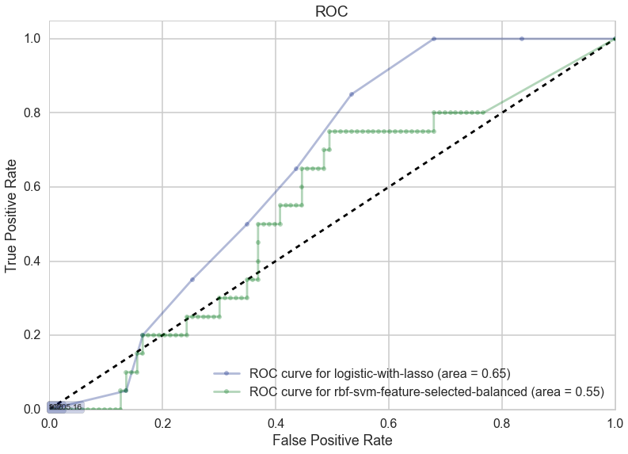

##3.4. Random Forest and Ensemble Methods
Besides logistics regressio and Random forest, we also try to use random forest and ensemble methods for prediction.

####3.4.1 Random Forest and Ensemble Methods
Recall from class that the random forest technique works by aggregating the results from a number of randomly perturbed decision trees constructed to explain the data.

Below in **Part 4**, we show the predictions of the random forest model, there are 5 movies in total. We can see that these 5 movies are quite different from those predicted from the logistics model. It indicates that our models are not consistent with the predictions, therefore lower the reliability of the predictions. Also, the predictions from random forest are not stable, that is, the number of positive predictions it returns varies with each run. In other words, the movies being predicted are not the same everytime.

####3.4.2 Relative Importance
Following the standard procedure of random forest, we plot out the relative importance of features. We can see that tomatoUserReviews, Year, Runtime and A_mean_age are among the top important features.

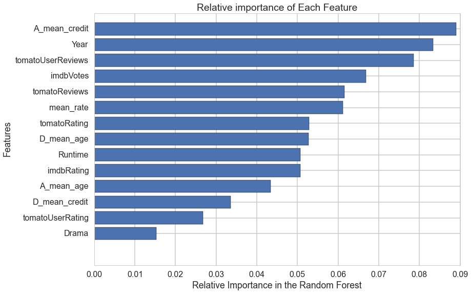

####3.4.3 AdaBoost Classifier
We also use the AdaBoost classifier from the lab to make prediction to see if there is any different. The method gives us no positive predictions on the 2015 data set.

Therefore, we used SVM, logistics regression, Random forest and AdaBoost classifier to make our predictions. Only logistics and random forest gave us some movie predictions. They are:

##4. Prediction results
As mentioned in **Part 3**, we only have positive predictions when we use Logistic and Random Forest. We will now list them below. Please be reminded that we are asking the question: what movies are most likely to win at least one award from the five categories: Best Picture, Directing, Best Actor in a Leading Role, Best Actress in a Leading Role, Best Actress in a Supporting Role and Best Actor in a Supporting Role.

####Logistic Prediction
|                        |            |  |                |                  |
|------------------------|-----------------------------------------------------------------------------------------|--------------------------------------------------------------------------------------------------|-----------------------------------------------------------------------------------|--------------------------------------------------------------------------|
| Movie                  | Avengers: Age of Ultron                                                                 | Muhammad: The Messenger of God                                                                   | The Hateful Eight                                                                 | The Martian                                                              |
| Probability of winning | 0.388707757                                                                             | 0.327404359                                                                                      | 0.287890063                                                                       | 0.270072195                                                              |
|                        |                      |                           |  |  |
| Movie                  | Furious 7                                                                               | Straight Outta Compton                                                                           | Mad Max: Fury Road                                                                |                                                                          |
| Probability of winning | 0.254411701                                                                             | 0.238794011                                                                                      | 0.214512094                                                                       |                                                                          |
|                        |                 |                                    |                  |      |
| Movie                  | Jurassic World                                                                          | Spectre                                                                                          | Bridge of Spies                                                                   | Dilwale                                                                  |
| Probability of winning | 0.204840498                                                                             | 0.197618822                                                                                      | 0.191980406                                                                       | 0.164262945                                                              |
|                        |  |                                  |                    |                                                                          |
| Movie                  | Mission: Impossible - Rogue Nation                                                      | Spotlight                                                                                        | The Revenant                                                                      |                                                                          |
| Probability of winning | 0.163706043                                                                             | 0.162100329                                                                                      | 0.156593219                                                                       |                                                                          |

Random forest predictions

<table>
<tr>
<th>Movie</th>
<th>Poster</th>
</tr>
<tr>
<td>San Andreas</td>
<td>

</td>
</tr>
</table>

5. Conclusion
7. 
8. Final Analysis: What did you learn about the data? How did you answer the questions? How can you justify your answers?

Presentation: Present your final results in a compelling and engaging way using text, visualizations, images, and videos on your project web site.

Describe the storytelling elements and goals in your process notebook and show us sketches and screenshots of different website iterations. As this will be your only chance to describe your project in detail make sure that your process book is a standalone document that fully describes your process and results.

    
